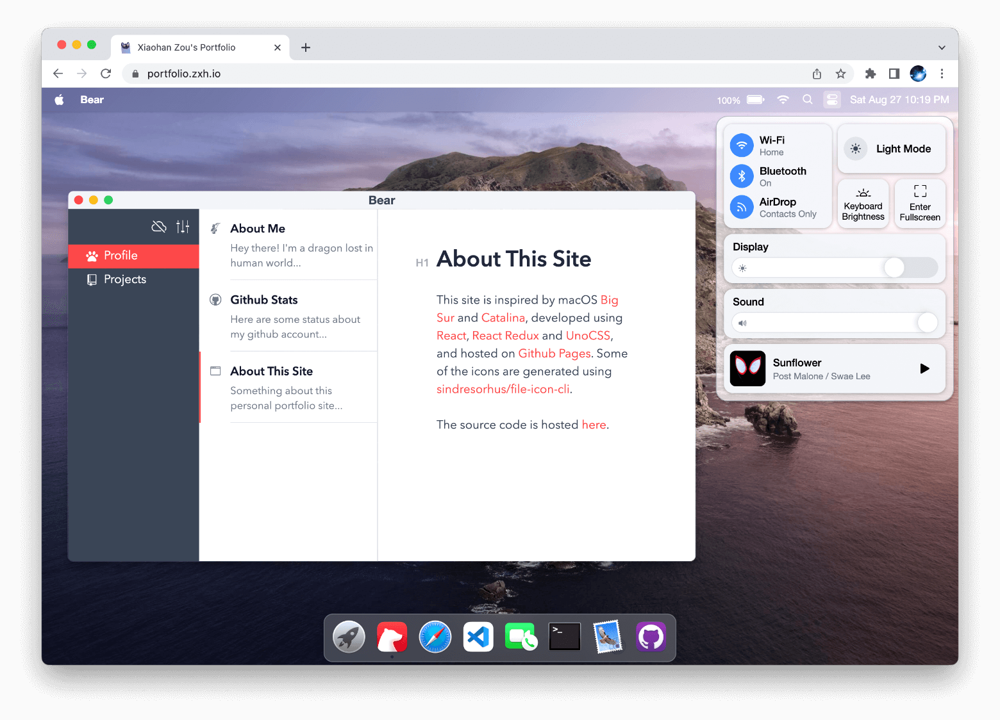
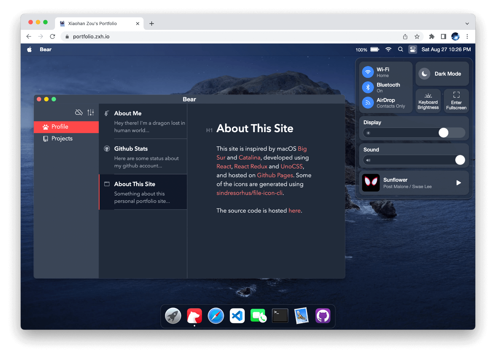

# playground-macos

My portfolio website simulating macOS's GUI: https://portfolio.zxh.me

Powered by [React](https://reactjs.org/) + [Zustand](https://zustand-demo.pmnd.rs/) + [UnoCSS](https://uno.antfu.me/) + [TypeScript](https://www.typescriptlang.org/) + [Vite](https://vitejs.dev/).





&nbsp;
## git commit
```bash
pnpm -v
git commit -m "[feat] "
```

## Usage
* download and install [node](https://nodejs.org/en/download/package-manager)
```bash
fnm env
fnm use v22.11.0
node -v

npm i -g pnpm
```

install pnpm as an npm package with $ npm i -g pnpm.  [link](https://blog.logrocket.com/javascript-package-managers-compared/)

Clone the repo and install dependencies:

```bash
pnpm install
```

Start dev server (with hot reloading):

```bash
pnpm dev
```

Build for production with minification to the `dist` folder:

```bash
pnpm build
```

&nbsp;


## icons

**i-ri**

The prefix **`i-ri`** in `i-ri:gamepad-line` indicates that the icon belongs to the **Remix Icon (RI)** library.

1. **`i-` Prefix**: Like with `i-mdi`, this prefix is used in tools like [Iconify](https://iconify.design/) to integrate various icon sets in a consistent way.
2. **`ri`**: Refers to the [Remix Icon](https://remixicon.com/) library, a set of open-source icons designed for web and user interfaces.
3. **`gamepad-line`**: This is the specific name of the icon in the Remix Icon library. The suffix `-line` indicates that it's an outline-style icon (as opposed to solid-style).

Visit the official [Remix Icon website](https://remixicon.com/) and search for "gamepad-line."

You can also browse Remix Icon through Iconify, which provides additional options for integrating these icons into your project.

### i-mdi

The prefix **`i-mdi`** in `i-mdi:chart-bar-stacked` refers to an icon library integration, specifically **Material Design Icons (MDI)**. Here's what it means:

**`i-` Prefix**: This prefix is commonly used in tools or libraries like [Iconify](https://iconify.design/), which provide a unified way to include icons from multiple libraries.

**`mdi`**: Refers to the [Material Design Icons](https://materialdesignicons.com/) library, an open-source set of icons inspired by Google's Material Design guidelines.

**`chart-bar-stacked`**: This is the specific icon name in the MDI library.


## Changelog

- **Update 2023.06.26**: Improve [FaceTime](https://support.apple.com/en-us/HT208176).

- **Update 2023.06.25**: Add [Typora](https://typora.io/), built on top of [Milkdown](https://milkdown.dev/).

- **Update 2021.12.05**: Simulated the device's actual battery state using [Battery API](https://developer.mozilla.org/en-US/docs/Web/API/Battery_Status_API), displaying 100% charge on [unsupported browsers](https://developer.mozilla.org/en-US/docs/Web/API/Battery_Status_API#browser_compatibility).

- **Update 2021.12.05**: Refactored for cleaner code by utilizing functional components and hooks. Refer to [this branch](https://github.com/Renovamen/playground-macos/tree/class-component) for the previous version implemented with class components.


&nbsp;

## Credits

- macOS
  - [Monterey](https://www.apple.com/macos/monterey/)
  - [Catalina](https://www.apple.com/bw/macos/catalina/)
- [macOS Icon Gallery](https://www.macosicongallery.com/)
- [sindresorhus/file-icon-cli](https://github.com/sindresorhus/file-icon-cli)
- [vivek9patel.github.io](https://github.com/vivek9patel/vivek9patel.github.io)


&nbsp;

## License

[MIT](MIT)
