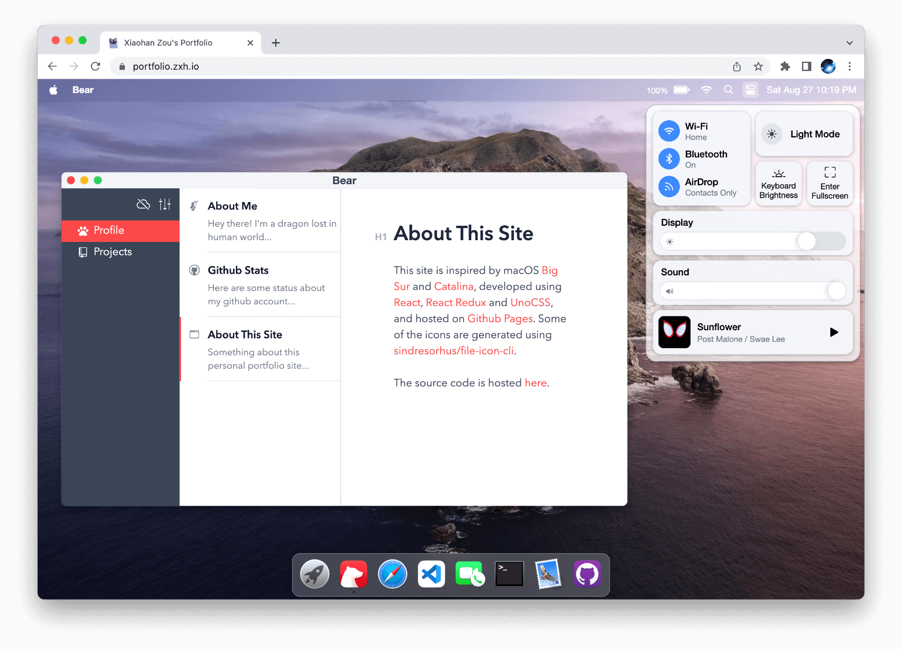
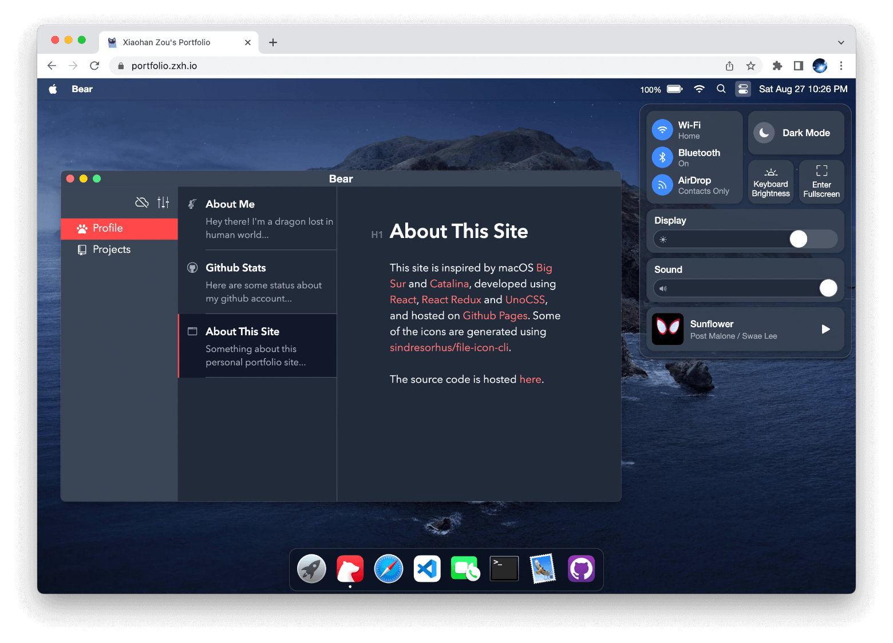

# playground-macos

My portfolio website simulating macOS's GUI: https://portfolio.zxh.me

Powered by [React](https://reactjs.org/) + [Zustand](https://zustand-demo.pmnd.rs/) + [UnoCSS](https://uno.antfu.me/) + [TypeScript](https://www.typescriptlang.org/) + [Vite](https://vitejs.dev/).





&nbsp;
## git commit
```bash
pnpm -v
git commit -m "[feat] "
```

## Usage
* install [fnm](https://github.com/Schniz/fnm) and then use the pinned Node.js version from this repo
```bash
fnm install
fnm use
node -v

corepack enable
pnpm -v
```

`fnm` is a fast Node.js version manager. It lets each project use its own Node version, so this workspace can stay on `v24.14.0` without affecting your global setup.

Clone the repo and install dependencies:

```bash
pnpm install
```

Start dev server (with hot reloading):

```bash
pnpm dev
```

Build for production with minification to the `dist` folder:

```bash
pnpm build
```

## Magnet workspace layouts

Use the horseshoe-magnet icon in the menu bar to apply a configured desktop workspace. The initial `time->work+out` layout opens Own Pie, Deltek Pro, and Jog-log in equal left-to-right columns while keeping the menu bar, Dock, and unrelated windows available.

Layouts are defined in [`src/configs/layouts.ts`](src/configs/layouts.ts). Add another object with a stable `id`, menu `label`, and ordered `slots` containing desktop app IDs. Each referenced app must be registered in [`src/configs/apps.tsx`](src/configs/apps.tsx) with `desktop: true`; set `dock: false` when the app should be launchable by layouts and Spotlight without appearing in the Dock.

Applying a layout opens or restores its apps, resets maximize/minimize state, raises them above existing windows, and recalculates the equal columns when the viewport or Dock size changes. The iframe destinations must allow framing and may still require their own authentication; blocked destinations should remain external links instead of being proxied or having frame protections bypassed.

&nbsp;


## icons

**i-ri**

The prefix **`i-ri`** in `i-ri:gamepad-line` indicates that the icon belongs to the **Remix Icon (RI)** library.

1. **`i-` Prefix**: Like with `i-mdi`, this prefix is used in tools like [Iconify](https://iconify.design/) to integrate various icon sets in a consistent way.
2. **`ri`**: Refers to the [Remix Icon](https://remixicon.com/) library, a set of open-source icons designed for web and user interfaces.
3. **`gamepad-line`**: This is the specific name of the icon in the Remix Icon library. The suffix `-line` indicates that it's an outline-style icon (as opposed to solid-style).

Visit the official [Remix Icon website](https://remixicon.com/) and search for "gamepad-line."

You can also browse Remix Icon through Iconify, which provides additional options for integrating these icons into your project.

### i-mdi

The prefix **`i-mdi`** in `i-mdi:chart-bar-stacked` refers to an icon library integration, specifically **Material Design Icons (MDI)**. Here's what it means:

**`i-` Prefix**: This prefix is commonly used in tools or libraries like [Iconify](https://iconify.design/), which provide a unified way to include icons from multiple libraries.

**`mdi`**: Refers to the [Material Design Icons](https://materialdesignicons.com/) library, an open-source set of icons inspired by Google's Material Design guidelines.

**`chart-bar-stacked`**: This is the specific icon name in the MDI library.


## Changelog

- **Update 2023.06.26**: Improve [FaceTime](https://support.apple.com/en-us/HT208176).

- **Update 2023.06.25**: Add [Typora](https://typora.io/), built on top of [Milkdown](https://milkdown.dev/).

- **Update 2021.12.05**: Simulated the device's actual battery state using [Battery API](https://developer.mozilla.org/en-US/docs/Web/API/Battery_Status_API), displaying 100% charge on [unsupported browsers](https://developer.mozilla.org/en-US/docs/Web/API/Battery_Status_API#browser_compatibility).

- **Update 2021.12.05**: Refactored for cleaner code by utilizing functional components and hooks. Refer to [this branch](https://github.com/Renovamen/playground-macos/tree/class-component) for the previous version implemented with class components.


&nbsp;

## Credits

- macOS
  - [Monterey](https://www.apple.com/macos/monterey/)
  - [Catalina](https://www.apple.com/bw/macos/catalina/)
- [macOS Icon Gallery](https://www.macosicongallery.com/)
- [sindresorhus/file-icon-cli](https://github.com/sindresorhus/file-icon-cli)
- [vivek9patel.github.io](https://github.com/vivek9patel/vivek9patel.github.io)


&nbsp;

## License

[MIT](MIT)
